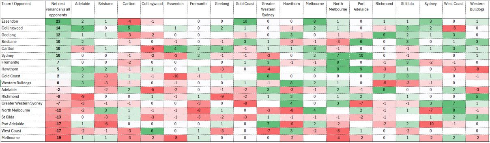
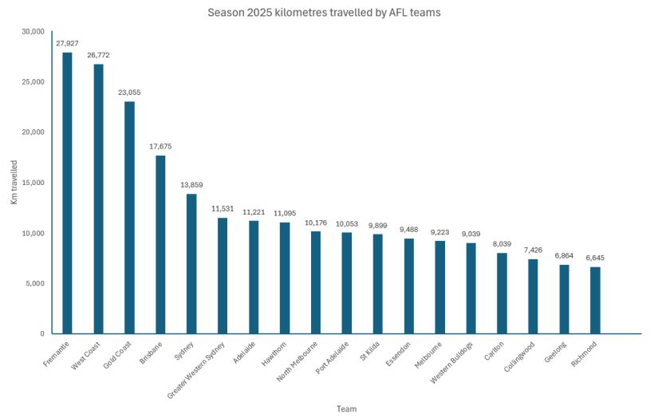
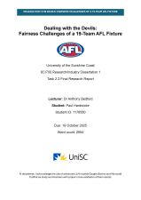
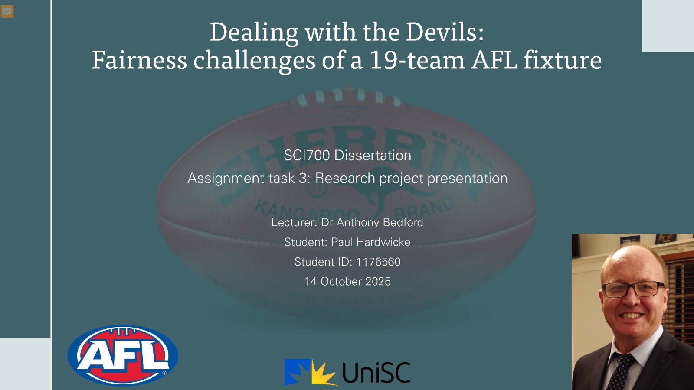

<a href="index.html">Home</a>  

# Master of ICT capstone project  

My capstone project ('Dealing with the Devils: Fairness Challenges of a 19-Team AFL Fixture'), a work in progress, addresses a complex combinatorial optimisation challenge to achieve fairness in Australian Football League (AFL) match scheduling.  

## Target audience  

The thesis will be submitted to the University of the Sunshine Coast as part of a Master of Information and Communications Technology.  

Stakeholders include the AFL, its participating clubs and players, match broadcast partners, match venues, and AFL football club members and supporters.  

## Problem definition  

Rather than playing a single (17-match) or dual (34-match) round-robin, the 18 AFL teams play 11 opponents once and 6 opponents twice; i.e., 23 matches per team per season.  
With a 23-match season considered optimal, the AFL will be 5 teams short of single round-robin scheduling simplicity when Tasmania joins the league in 2028.  

Trillions of combinations exist to pair opponents for the 6 repeat match-ups required to bridge this gap. The pairing of repeat opponents impacts all teams' chances of premiership success, and it is a primary source of scheduling inequity. Others include rest day disparity and the travel burden for teams outside of Victoria. The addition of the Tasmania Devils, making an uneven 19 teams, is likely to exacerbate scheduling difficulty.  

## Proposal  

The scheduling problem will be addressed by prioritising competitive fairness over commercial objectives. Scheduling governance and mathematical optimisation will be applied to minimise statistically significant advantages and disadvantages.  

I will quantify fairness in terms of teams' home ground advantage, player welfare, strength of schedule (i.e., opponent strength), and travel burden, by applying a weighted-sum minimisation model. I will analyse interdependent data sets to establish equity baselines, using historical match data from seasons 2012 to 2025, to inform recommendations for scheduling changes. Methodology will include multi-objective optimisation with a Pareto frontier; for example, balancing teams' cumulative travel burdens with runs of consecutive home or away games ('breaks'). 

### Rest variance  
Rest variance occurs when two teams have disparate numbers of rest days preceding a match, typically providing advantage to the more rested team. The frequency of rest variance increased in season 2025 with the introduction of regular Thursday night games.  

This can be addressed when fixtures are generated by flagging rest day disparities of 3 or more days. A constraint can be introduced where no team can play an opponent with more than 2 additional rest days, excluding matches that follow bye rounds.

The heat map below illustrates inequity in rest days that preceded matches in season 2025. For example, Essendon had an additional 2 days' rest prior to playing Adelaide and 2 fewer days prior to playing Collingwood. Essendon the was most advantaged and Melbourne the most disadvantaged team over the season. It is noted that five of the top 8 'rested' teams qualified to play finals.  

**2025 net rest heat map**
  

### Travel variance  
'Gather Round', a carnival where all 9 matches are played in and around Adelaide, was introduced in season 2023. It has proven successful for both the league and South Australian tourism. This can be leveraged by matching teams from the West and East coasts (e.g., Gold Coast vs Fremantle, Sydney vs West Coast) to equalise their respective travel burdens; and prioritising these match-ups over those most commercially appealing.  

Similarly, a 4-match mini-carnival can be scheduled in Tasmania. This would feature the Devils and teams that have invested in Tasmanian supporter bases; that is, Hawthorn since 2001, North Melbourne since 2012, and Richmond commencing in 2026.  

Road trips can be cost-prohibitive, and have historically been avoided with cumulative travel being considered detrimental to player welfare. In 2025, North Melbourne played consecutive home games in Western Australia against Fremantle and West Coast. Other teams, particularly from outside Victoria, could exploit this strategy to reduce the frequency of long flights.  

The chart below illustrates the variance in total distance travelled by each team to play matches in 2025. Richmond travelled 6,645 km, less than a quarter of the 27,927 km travelled by Fremantle.    

**2025 travel variance**
  

## Scheduling constraints 
The AFL imposes myriad scheduling constraints, as exemplified below. Constraints impact the distribution of marquee matches, venue assignments, broadcast slots, and repeat match-ups. 'Soft' constraints  are preferred but not mandatory, and include the 'weighted rule', where the previous season's ladder placings dictate team groupings for repeat match-up allocations. 'Hard' constraints must be incorporated to the schedule, and include:  

* Home ground advantage:  
  * Maximum 1 home match per round in non-Victorian states.
  * Minimum 43 matches at Marvel Stadium and 47 at the MCG.
  * Minimum 1 home match against either Collingwood or Essendon.
  * Minimum 5 matches in Victoria and 1 at the MCG.  

* Player welfare:    
  * Minimum 5 clear days between matches. For example, a team cannot play on Saturday in Round 1 and 5 days later on Thursday in Round 2. 
  * Minimum 6 rounds must separate repeat visits to WA and to Queensland.
  * Teams must not play 3 consecutive away (or home) games.  

* Strength of schedule:  
  * Marquee matches, including repeated Grand final rematches and traditional rivalries, and blockbusters such as ANZAC Day matches, are mandatory.
  * Minimum 6 rounds between repeat match-ups, with the second meeting not to occur before Round 11.  

* Travel burden:  
  * Every team must travel to WA at least once.  
  * Non-Victorian teams that travelled in the final round of the previous season must not travel in the final round of the current season.  
  * Teams must not play consecutive matches in two different 'away states'.  
  * Victorian teams must play outside Victoria a minimum of 5 times.  

**Research proposal document**
This research proposal was submitted for assessment in October 2025.  
   

**Research proposal presentation**
This research proposal presentation was delivered for an audience of University of the Sunshine Coast academics and student peers in October 2025.  
  
