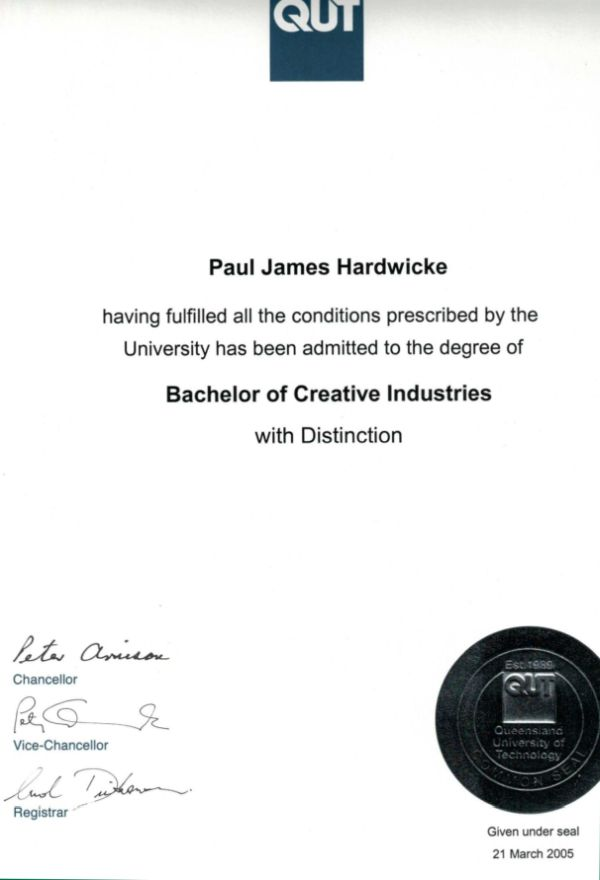

# Paul Hardwicke | ICT portfolio  

## Professional statement  

Adaptable and dedicated information and communications technology (ICT) professional committed to data and content integrity in enterprise-level digital projects.  

With more than 15 years of ICT experience and a lifelong growth mindset, I am positioned to leverage academic research to address complex systems development challenges.  

**Capstone project:** My <a href="capstone-project.html" target="_blank">Master of ICT capstone project</a> applies contemporary data analysis techniques to optimise AFL match scheduling. It demonstrates my information governance and systems development capabilities through the management of interdependent data sets and quality assurance baselines.  

**Career objective:** Seeking to explore growth opportunities in data management that will leverage my ICT employment, academic research, and industry best practice certifications.  
 

## Skills matrix  

This matrix aligns Skills Framework for the Information Age (SFIA) and career development theory (CDT) capabilities to my recent employment history and academic research.

| SFIA description | Employment example | CDT/ employment alignment | Research example | CDT/ research alignment |
| :--- | :--- | :--- | :--- | :--- | 
| **BSMO:** Business modelling | Develop enterprise web content workflows and roles for a video platform that supports an organisation of 90,000 staff. | Enterprising: Direct organisational systems for large-scale impact. | Apply a weighted-sum minimisation model and quantify inequities for a 19-team AFL season. | Investigative: Apply mathematical abstraction to solve real-world fairness challenges. |
| **DATM:** Data management | Implement annual content currency reviews to enforce data quality and retention policies. | Self-Efficacy: Build mastery in data governance through policy enforcement. | Compile a 14-season historical AFL dataset to ensure research integrity. | Self-Efficacy: Manage large-scale data to validate analytical outcomes. |
| **DLMG:** Systems development management | Triage IT tickets and quality requirements for large-scale corporate websites. | Factor: Apply detail-oriented traits to meet structured operational requirements. | Manage project milestones for a scheduling model. | Establishment: Plan career-defining research milestones. |
| **DTAN:** Data modelling and design | Analyse website taxonomies to maintain content with more than 100 stakeholders. | Investigative: Use analytical skills to solve organisational hierarchy issues. | Apply Pareto frontier analysis to optimise conflicting travel and break match constraints. | Investigative: Model data to optimise conflicting constraints. |
| **GOVN:** Governance | Author governance frameworks for web and video content for executive implementation. | Maintenance: High-level professional identity through strategic leadership. | Apply scheduling constraints to model a 19-team season framework. | Establishment: Establish authority in a specialised area of system governance. |
| **HSIN:** Systems installation and removal | Gather business requirements as part of a technical change management process for an enterprise platform upgrade. | Self-Efficacy: Automate system behaviours to reduce risks and increase efficiency. | Transition the AFL season architecture from an even 18 teams to an uneven, more complex 19 teams. | Self-Efficacy: Address unprecedented system logic challenges. |
| **QUAS:** Quality assurance | Audit content published by distributed authors to ensure adherence with legal accessibility and departmental standards. | Trait: Align attention to detail with regulatory compliance needs. | Apply logic checks to season schedules to meet constraint requirements. | Factor: Ensure logic compliance through systematic verification. |
| **STPL:** Enterprise and business architecture | Define relationships between content owners, publishing processes, and web assets to ensure a single source of truth for 1500 pages of intranet content. | Happenstance: Demonstrate optimism in coordinating 150 stakeholders to achieve an integrated architectural vision. | Balance diverse stakeholder priorities with variables such as travel burden and commercial drivers. | Happenstance: Demonstrate adaptability by applying governance expertise to the technical domain of combinatorial optimisation. |

## Employment 2011-2026  

### AO6 Senior web officer, Queensland Government Department of Education (current role, full time)  

Employment-related capability examples in addition to those provided above include:  

#### Information governance (SFIA: GOVN)  

* Developed comprehensive guides for web content and video publishing, establishing publishing standards approved by the Chief Information Officer.  
* Developed an annual content review program for more than 100 business unit directors, reducing data redundancy and improving intranet content currency.  

#### Quality assurance (SFIA: QUAS)  

* Evaluated the strategic impact of the Australian Government Social Media Minimum Age Act 2024, providing executive recommendations to maintain engagement with a priority audience of more than 500,000 Queensland school students.  
* Modernised a video publishing framework to meet stringent Information Privacy Act 2009 (Qld) amendments, implementing changes to meet privacy and consent, legal, and recordkeeping requirements.  

#### Systems development management (SFIA: DLMG)  

* Restructured complex website information architecture to migrate legacy enterprise websites to SharePoint CMS, improving user journeys and data discoverability.  

### Employment commendations  

| AO8 managerial higher duty relief | Values award | AO7 managerial higher duty relief | Excellence commendation |
| :--- | :--- | :--- | :--- |
|  |  |  |  |

## Education  

Unique student identifier (USI): LCE9ML8267  

### 2023–2026: Master of Information and Communications Technology, University of the Sunshine Coast (scheduled for completion June 2026)  

Current GPA 6.1.  
Information about my research-related capabilities is provided in my <a href="capstone-project.html" target="_blank">capstone project</a>, 'Dealing with the Devils: AFL match scheduling optimisation', due for submission in February 2026. 

### Completed tertiary education  

<table>
  <thead>
    <tr>
      <th width="33.3%">Graduate Certificate in Information Systems, GPA 6.8</th>
      <th width="33.3%">Graduate Certificate in Information Technology, GPA 7.0</th>
      <th width="33.4%">Bachelor of Creative Industries, GPA 6.2</th>
    </tr>
  </thead>
  <tbody>
    <tr>
      <td align="center">
        

          
        

      </td>
      <td align="center">
        

          
        

      </td>
      <td align="center">
        

          
        

      </td>
    </tr>
    <tr>
      <td valign="top"><strong>Excelled in: </strong>Business Requirements Analysis, Foundation Skills in Data Analysis, Information Management & Security, Value of Information </td>
      <td valign="top"><strong>Excelled in: </strong>Entrepreneurship & Collective Intelligence, e-Strategic Management, Internet Fundamentals, Problem Solving & Programming </td>
      <td valign="top"><strong>Sub-majors: </strong>Communication, Digital Media </td>
    </tr>
  </tbody>
</table>

## Microsoft certifications  

| Azure Data | Power Platform | Security & Compliance |
| :---: | :---: | :---: |
|  |  |  |
| Azure data services used to support data modelling and design. | Build basic data solutions, automate business processes, perform data analysis. | Information security and governance using cloud-based solutions. |

## Technical competencies  

* Adobe Creative Cloud
* HTML
* Mediasite video platform
* Microsoft 365 
* Service Now ICT ticket management
* SharePoint CMS
* SQL Server Management Studio
* Visual Studio Code

## Private enterprise  

Co-owner of <a href="https://essentialediting.com.au/" target="_blank">Essential Editing</a>, a proofreading and editing business focused on polishing academic theses in preparation for submission.

## Contact  

* Phone: (+61) 400 332 433
* Email: <a href="mailto:paul.hardwicke@gmail.com" target="_blank">paul.hardwicke@gmail.com</a>

## Curriculum vitae  

<a href="assets/docs/CV.pdf" target="_blank">CV - Paul Hardwicke</a>  

