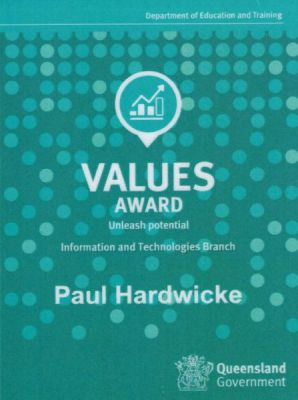
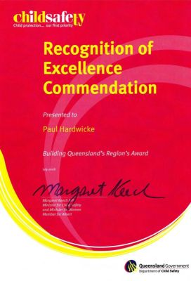
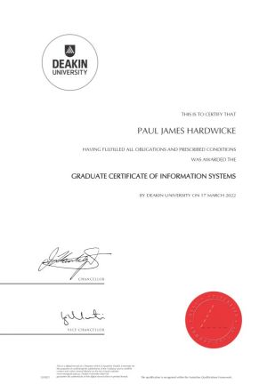
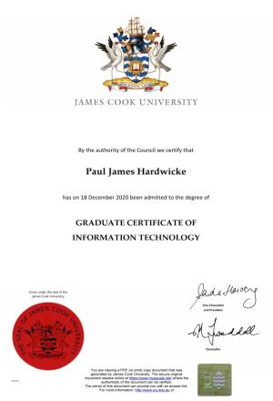

# Paul Hardwicke | ICT Professional | Portfolio
## Professional statement
Adaptable, optimistic, and persistent information and communications technology (ICT) professional committed to data and content integrity in enterprise-level digital projects.  
With more than 15 years of ICT experience and a lifelong growth mindset, I am now positioned to leverage academic research to address complex systems development challenges.  
My current Master of ICT capstone dissertation applies contemporary data analysis techniques to optimise AFL match scheduling. It demonstrates my information governance and systems development capabilities through the management of interdependent data sets and quality assurance baselines.  
**Career objective:** Seeking to explore growth opportunities in data management that will leverage my ICT employment, academic research, and industry best practice certifications.

## Skills matrix
This matrix aligns Skills Framework for the Information Age (SFIA) and career development theory (CDT) capabilities to my recent employment history and academic research.

| SFIA description | Employment example | CDT/ employment alignment | Research example | CDT/ research alignment |
| :--- | :--- | :--- | :--- | :--- | 
| **BSMO** Business modelling: Model business scenarios and represent processes, data, and roles to support analysis | Developed enterprise web content workflows and roles for a video platform that supports an organisation of 90,000 staff. | Holland (Enterprising): Directing organisational systems for large-scale impact. | Applying a weighted-sum minimisation model and quantifying inequities for a 19-team AFL season. | Holland (Investigative): Applying mathematical abstraction to solve real-world fairness challenges. |
| **DATM** Data management: Develop policies and practices that control, protect, and optimise the value of data assets. | Implemented annual content currency reviews to enforce data quality and retention policies. | Bandura (Self-Efficacy): Building mastery in data governance through policy enforcement. | Compiling a 14-season historical AFL dataset to ensure research integrity. | Bandura (Self-Efficacy): Managing large-scale data to validate analytical outcomes. |
| **DLMG** Systems development management: Plan, estimate, and execute systems to time, budget, and quality targets. | Triaged Service Now ICT tickets and quality requirements for large-scale corporate websites. | Parsons (Factor): Applying detail-oriented traits to meet structured operational requirements. | Developed a timeline to manage project milestones for a scheduling model. | Super (Establishment): Planning career-defining research milestones. |
| **DTAN** Data modelling and design: Develop models to represent, communicate, and manage data requirements. | Analysed website taxonomies to ensure content maintenance by more than 100 business unit directors. | Holland (Investigative): Using analytical skills to solve organisational hierarchy issues. | Applying Pareto frontier analysis to optimise conflicting travel and break match constraints. | Holland (Investigative): Modelling data to optimise conflicting constraints. |
| **GOVN** Governance: Define frameworks for decision-making, risk management, and requirements compliance. | Authored web content and video publishing governance frameworks for executive implementation. | Super (Maintenance): High-level professional identity through strategic leadership. | Applying scheduling constraints to model the 19-team season framework. | Super (Establishment): Establishing authority in a specialised area of system governance. |
| **HSIN** Systems installation and removal: Install, test, decommission, and remove systems. | Gathered business requirements as part of a technical change management process for an enterprise video platform upgrade. | Bandura (Self-Efficacy): Automating system behaviours to reduce risk associated with human error and increase efficiency. | Transitioning the AFL season architecture from an even 18 teams to an uneven, complex 19 teams. | Bandura (Self-Efficacy): Addressing unprecedented system logic challenges. |
| **QUAS** Quality assurance: Assure, through ongoing and periodic assessments and reviews, that quality objectives are met. | Audited content published by distributed authors to ensure adherence with legal accessibility and departmental standards. | Parsons (Trait): Aligning attention to detail with regulatory compliance needs. | Applying logic checks on generated schedules to meet constraints. | Parsons (Factor): Ensuring logic compliance through systematic verification. |
| **STPL** Enterprise and business architecture: Align technology strategy to an organisation's mission, strategy, and processes using architectural models. | Defined relationships between content owners, publishing processes, and web assets to ensure a single source of truth for 1500 pages of intranet content. | Krumboltz (Happenstance): Demonstrates optimism in that stakeholders across a large organisation can work together to achieve an integrated architectural vision. | Balancing diverse stakeholder priorities with variables such as travel logistics and commercial drivers. | Krumboltz (Happenstance): Demonstrates adaptability by successfully applying governance expertise to the technical domain of combinatorial optimisation. |

## Employment 2011-2026 
### AO6 Senior web officer, Queensland Government Department of Education (current role, full time)

Employment-related capability examples in addition to those provided above are as follows:

#### Information governance (SFIA: GOVN)
* Developed comprehensive guides for web content and video publishing, establishing publishing standards approved by the Chief Information Officer. 
* Developed an annual content review program for more than 100 business unit directors, reducing data redundancy and improving intranet content currency.

#### Quality assurance (SFIA: QUAS)
* Evaluated the strategic impact of the Australian Government Social Media Minimum Age Act 2024, providing executive recommendations to maintain engagement with a priority audience of more than 500,000 Queensland school students.
* Modernised a video publishing framework to meet stringent Information Privacy Act 2009 (Qld) amendments, implementing changes to meet privacy and consent, legal, and recordkeeping requirements.

#### Systems development management (SFIA: DLMG)
* Restructured complex website information architecture to migrate legacy enterprise websites to SharePoint CMS, improving user journeys and data discoverability.

### Commendations  

| AO8 managerial higher duty relief | Values award | AO7 managerial higher duty relief | Excellence commendation |
| :--- | :--- | :--- | :--- |
|  |  |  |  |

## Education
Unique student identifier (USI): LCE9ML8267

### 2023–2026: Master of Information and Communications Technology, University of the Sunshine Coast (scheduled for completion June 2026)  
Current GPA 6.1.  
Information about my research-related capabilities is provided in my capstone project, <a href="capstone-project.md" target="_blank">Dealing with the Devils: AFL Match Scheduling Optimisation</a>, scheduled for completion in February 2026.

### Completed tertiary education

| Graduate Certificate in Information Systems | Graduate Certificate in Information Technology | Bachelor of Creative Industries |
| :--- | :--- | :--- |
| GPA 6.8 | GPA 7.0 | GPA 6.2 |
|  |  |  |

## Microsoft certifications

| Azure Data | Power Platform | Security & Compliance |
| :--- | :--- | :--- |
|  |  |  |

## Technical competencies
* Adobe Creative Cloud
* HTML
* Mediasite video platform
* Microsoft 365 
* Service Now ICT ticket management
* SharePoint CMS
* SQL Server Management Studio
* Visual Studio Code

## Private enterprise
Co-owner of <a href="https://essentialediting.com.au/" target="_blank">Essential Editing</a>, a proofreading and editing business focused on polishing academic theses in preparation for submission.

## Contact
* Phone: (+61) 400 332 433
* Email: <a href="mailto:paul.hardwicke@gmail.com" target="_blank">paul.hardwicke@gmail.com</a>

## Curriculum vitae
<a href="assets/docs/CV.pdf" target="_blank">CV - Paul Hardwicke</a>  

Portfolio updated 23/01/2026  
